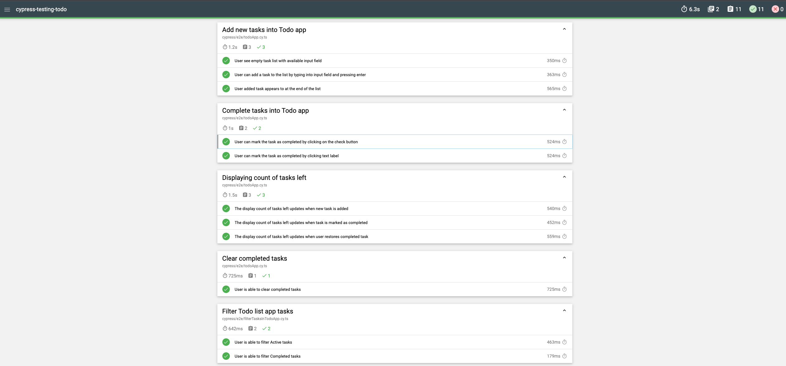

# cypress-testing-todo

## Test case for simple ToDo app - https://antondedyaev.github.io/todo_list

Test case overview: - 11 test scenarios

- Add new tasks
- Complete tasks into Todo app
- Displaying count of tasks left
- Clear completed tasks
- Filter Todo list app tasks

## Running tests locally

1. Clone git repo
2. Open repo and run command - `nvm use` to use NodeJS version from `.nvmrc` file
3. Install dependencies - `npm install`
4. Run cypress tests

   - Using script - `npm run cy:run` - It will run test in chrome headless mode
   - Using cypress dashboard run command - `npx cypress open` and run specific spec file.

5. Result will be saved in `cypress/e2e/reports/html` file.
   
